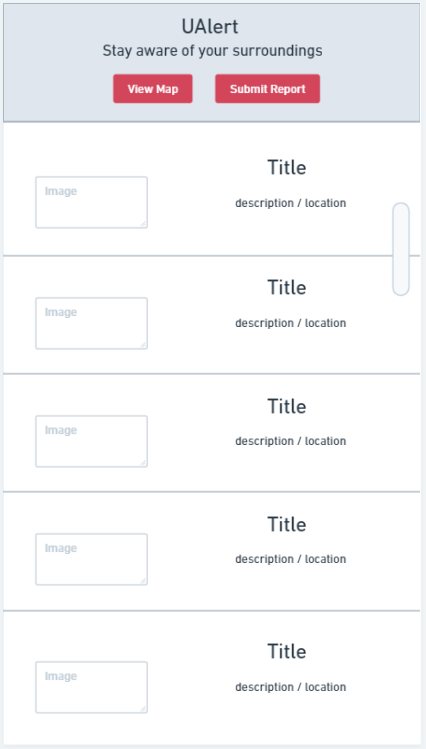

# Milestone 1

## Data Interactions
First opening the website directs you to an interactive map of UMass's campus. This map will have markers, with different colors and labels corresponding to the type of report, for areas in which reports have been made (designated during reporting by the user). Its interactions include being able to zoom in and slide around the map, with users being able to click directly on a marker and display a pop-up containing information regarding said report.
The list view page will simply be another way to view all of the recent reports made on campus, with a scrolling feed that shows the most recent report at the top. Each report shown on the feed will include all of the info that the user submitted in the report, unlike the map view where you need to click on a report to view details. Users will be able to scroll down in order to view older reports, as well as search through the list with filters.s
The Report page will be the way students/users can submit reports that go onto the interactive map and the list view page. This page will primarily be used to keep track of campus ongoings that aren't typically displayed or announced in flyers and emails. Users will also have the ability to edit or delete their past reports.

## Wireframes

## HTML/CSS Screenshots
### Map View

### List View

### Report Page

### Division of Labor
We plan on making 3 separate webpages for our app - one for the map, one for a list view of the reports, and one page to submit a report. Each person will write their respective part of the data interactions, wireframes, and code for their respective page. 
- Connor: map page
- James: list view page
- Nitant: submit report page
