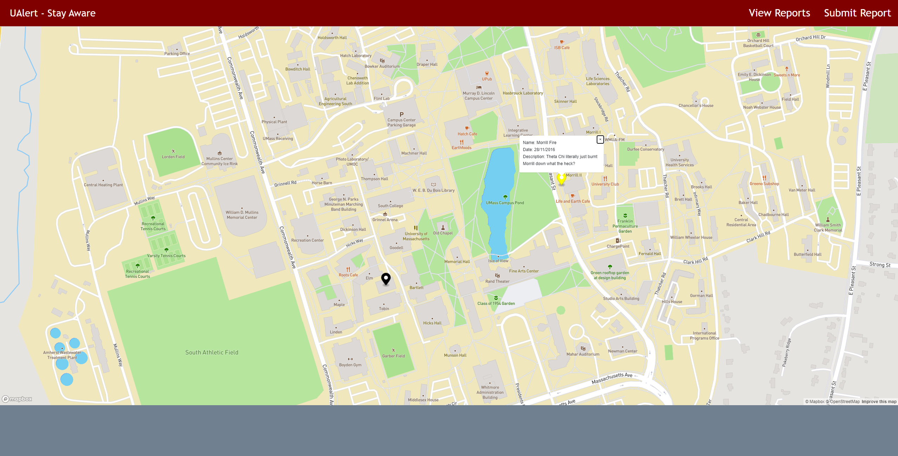

# Milestone 2

## Project API Planning

- Report Object - ID, name, date, description, location
- User Object - ID, name, email, password, list of reports
- Submissions - ReportID, UserID, date

- /report/new -- allows for a new report to be added to the collection of reports when a request is sent to this endpoint (contains ID (generated), name, date, description and location)
- /report/ID  -- viewing endpoint which returns the fields of the report
- /user/new OR /register -- allows a new user to be created
- /login -- allows any user to login and edit their submissions
- /user/ID/submit/new?ID=1234 -- creates a submission object for the given user and report ID
- /user/ID/submit/view -- returns all reports of the given user
- /user/ID/submit/delete?id=1234 -- deletes the given report ID for a SPECIFIC user

## Front-end Implementation

- Read: Below, you will see the map (main) view of the site; the map reads our inputted data by fetching from a local JSON file (pre-database), then displaying the events submitted using a marker format, where even marker can be clicked on to view details. Each marker is colored by the category submitted (yellow for hazards, black for general awareness, etc.)

## Division of Labor

Group work:
API planning and Back-end Skeleton

Individual work:
- Connor: Front-end for map
- James: Front-end for list
- Nitant: Front-end for submission
