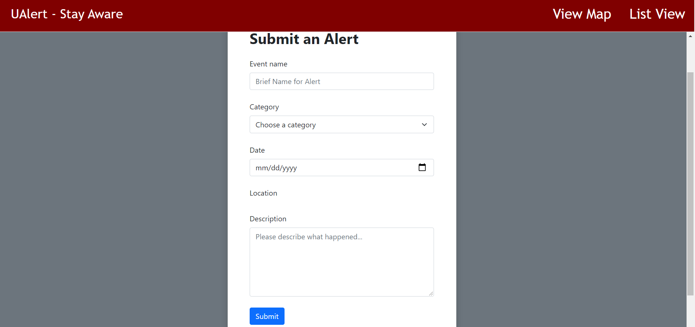

# Milestone 2

## Project API Planning

- Report Object - ID, name, date, description, location
- User Object - ID, name, email, password, list of reports
- Submissions - ReportID, UserID, date

- /report/new -- allows for a new report to be added to the collection of reports when a request is sent to this endpoint (contains ID (generated), name, date, description and location)
- /report/ID  -- viewing endpoint which returns the fields of the report
- /report/delete -- deletes the report

## Front-end Implementation

- Create: Shown below is the submit report page; the user can fill in information about their report and then submit it, where it will be sent to a JSON file.

- Read: Below, you will see the map (main) view of the site; the map reads our inputted data by fetching from a local JSON file (pre-database), then displaying the events submitted using a marker format, where even marker can be clicked on to view details. Each marker is colored by the category submitted (yellow for hazards, black for general awareness, etc.)

- Update and Delete: Finally, shown below is our list view of the reports, where a user can update or delete individual reports.

## Division of Labor

Group work:
API planning and Back-end Skeleton

Individual work:
- Connor: Front-end for map
- James: Front-end for list
- Nitant: Front-end for submission
